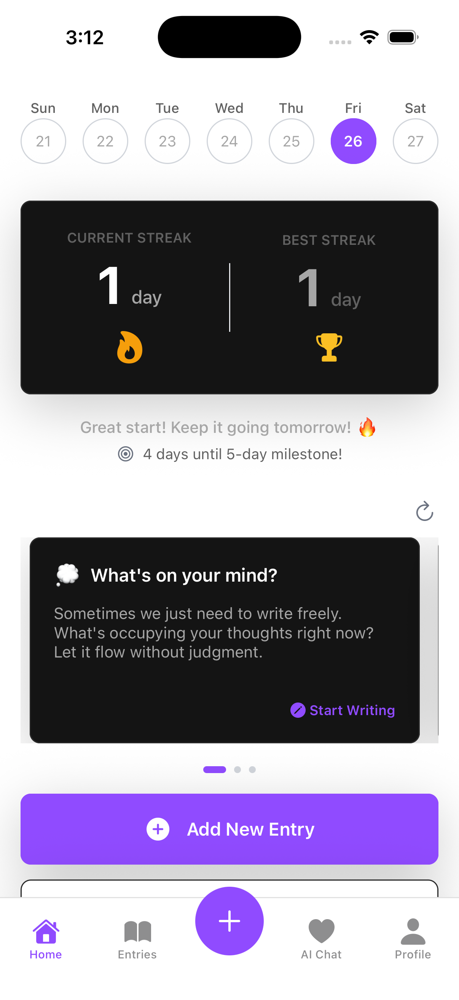
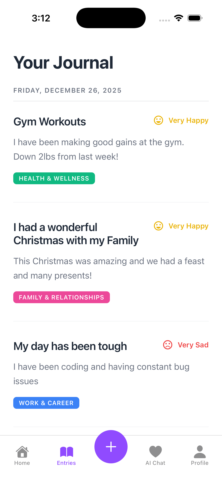
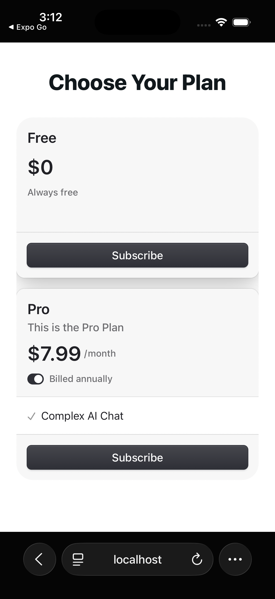

# AI-Powered Journal App (Expo + Sanity + Clerk + OpenAI)

[](https://expo.dev/)
[](https://reactnative.dev/)
[](https://react.dev/)
[](https://www.typescriptlang.org/)
[](https://www.sanity.io/)
[](https://clerk.com/)
[](https://openai.com/)
[](https://tamagui.dev/)
[](https://zod.dev/)

AI-powered journaling app built with **Expo (React Native)**, **Sanity CMS**, **Clerk authentication + billing**, **Tamagui**, and **OpenAI**.

- **Mobile-first**: iOS/Android is the primary experience.
- **Web is used for billing**: subscription management via Clerk’s web components (e.g. `/pricing`, `/plan-changed-success`).

## Features

- **Journal entries**: title (optional), mood tracking, rich content, image attachments.
- **Daily prompts**: swipeable prompt cards with “refresh” and “start entry” flows.
- **AI chat**: therapeutic-style chat that can fetch and reference your journal history.
- **Auto-categorization**: AI suggests an existing category or creates a new one.
- **Streak tracking**: compute current/longest streak + milestone messaging.
- **Auth + billing**: Clerk sign-in/sign-up and plan gating (`Protect plan="pro"`).

## Screenshots

| Home | AI Chat |
| --- | --- |
|  |  |

| Entries | Profile |
| --- | --- |
|  |  |

| Pricing (web) |
| --- |
|  |

## Repo structure

- **Expo app**: `app/` (Expo Router)
- **Sanity Studio**: `sanity/`
- **Sanity client + queries**: `lib/sanity/`
- **Shared utilities**: `lib/utils/`
- **Sample import data**: `sample_data/`
- **Developer guides**: `help/`

## Getting started

### Prerequisites

- Node.js 18+
- npm
- iOS Simulator (macOS + Xcode) and/or Android Emulator (Android Studio)
- Accounts:
  - Clerk (auth + billing)
  - Sanity (CMS)
  - OpenAI (AI chat/categorization)

### Install dependencies

Install dependencies for **both** the Expo app and the Sanity Studio:

```bash
# Expo app
npm install

# Sanity Studio
cd sanity
npm install
cd ..
```

## Environment variables

This project uses **two env files**:

### 1) Expo app: `.env` (project root)

Create `.env` at the project root:

```env
# Clerk (recommended)
# NOTE: This repo currently initializes <ClerkProvider> in app/_layout.tsx.
# If you add publishableKey there, use this var:
EXPO_PUBLIC_CLERK_PUBLISHABLE_KEY=pk_test_...

# Sanity (used by lib/sanity/client.ts)
EXPO_PUBLIC_SANITY_PROJECT_ID=yourProjectId
EXPO_PUBLIC_SANITY_DATASET=production

# WARNING: This token is currently referenced from client-side code.
# Prefer moving writes behind API routes if you plan to ship publicly.
EXPO_PUBLIC_SANITY_TOKEN=yourSanityWriteToken

# OpenAI (used server-side by Expo API routes in app/api/*)
OPENAI_API_KEY=sk-...
```

### 2) Sanity Studio: `sanity/.env.local`

Create `sanity/.env.local`:

```env
SANITY_STUDIO_SANITY_PROJECT_ID=yourProjectId
SANITY_STUDIO_SANITY_DATASET=production

# Optional if you need authenticated Studio operations
SANITY_STUDIO_SANITY_TOKEN=yourSanityToken
```

## Running locally

### 1) Start the Expo app

```bash
npx expo start
```

- Press `i` for iOS
- Press `a` for Android
- Press `w` for web (primarily used for billing pages)

### 2) Start Sanity Studio

```bash
cd sanity
npm run dev
```

Sanity Studio typically runs at `http://localhost:3333`.

## Sanity: import sample data (optional)

This repo includes sample datasets in `sample_data/`:

- `sample_data/sample-categories.ndjson`
- `sample_data/sample-daily-prompts.ndjson`
- `sample_data/test-journal-entries.ndjson` (useful for AI chat testing)

Import into your dataset (example uses `production`):

```bash
cd sanity
npx sanity dataset import ../sample_data/sample-categories.ndjson production
npx sanity dataset import ../sample_data/sample-daily-prompts.ndjson production
npx sanity dataset import ../sample_data/test-journal-entries.ndjson production
```

## API routes (Expo)

These server routes live in `app/api/`:

- `POST /api/chat` (`app/api/chat+api.ts`)
  - Streams responses using the Vercel AI SDK
  - Uses tools to fetch journal entries from Sanity (`lib/sanity/journal.ts`)
- `POST /api/categorize` (`app/api/categorize+api.ts`)
  - Uses structured output (`zod` + `generateObject`) to pick/create a category

## Billing / pricing (web)

- Pricing page: `app/pricing.tsx`
- Success redirect: `app/plan-changed-success.tsx`
- Deep link scheme is configured in `app.config.ts`:
  - `scheme: "sanityclerkbillingjournalappexpo"`

## Helpful docs in this repo

- AI chat testing: `help/AI-CHAT-TESTING.md`
- Auto-categorization notes: `help/AUTO-CATEGORIZATION.md`
- Image setup notes: `help/SETUP-IMAGES.md`, `help/IMAGE-SETUP-OFFICIAL.md`

## Troubleshooting

- **Metro cache issues**:

```bash
npx expo start -c
```

- **Sanity Studio env errors**: ensure `SANITY_STUDIO_SANITY_PROJECT_ID` and `SANITY_STUDIO_SANITY_DATASET` are set in `sanity/.env.local`.
- **OpenAI errors**: ensure `OPENAI_API_KEY` is present in the root `.env` (used by API routes).
